# --532
тут вы сможете найти мои работы и всякие мемы :D
# Лабораторная работа по Git

### Шаг 1: Проверка ветки
Использовал команду `git status`. Нахожусь на ветке `main`.
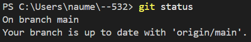
### Шаг 2: Проверка лога
Использовал команду `git log`
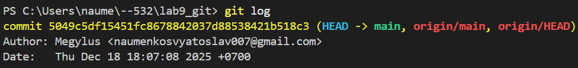
### Шаг 3: Создал файл с функцией сортировки:
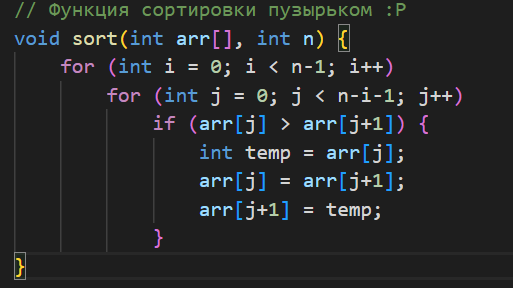
### Как выглядит git status:
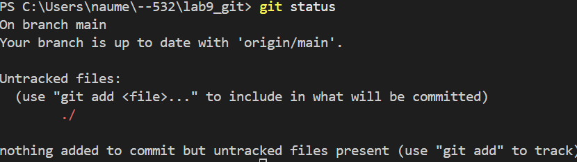
### добавляем нашу сортировочку:
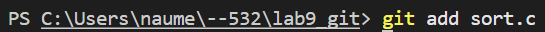
### что изменилось?
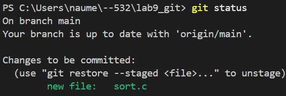
### коммитим
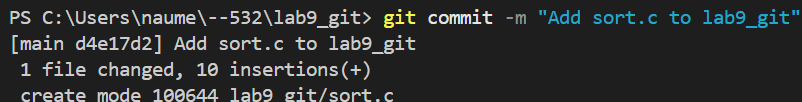
### что теперь?
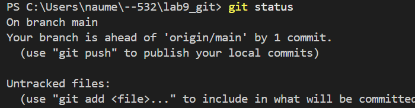
### добавил комментарий 
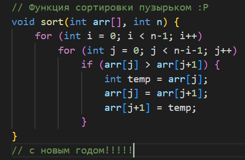'
### статус поменылся:
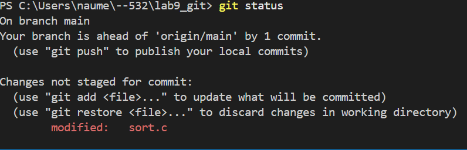
### снова адднул файл
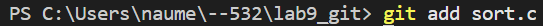
### снова чекнул статус
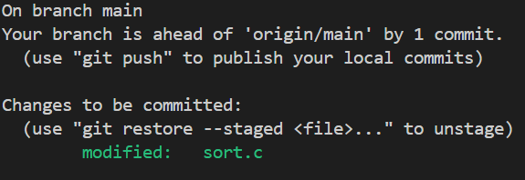
### новый комментарий(тяп тяп тяп)
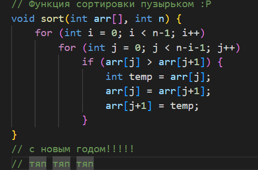
### новый коммит!!!!

### новые статус и лог!!!
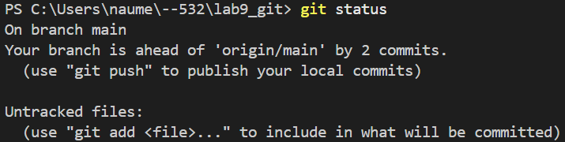
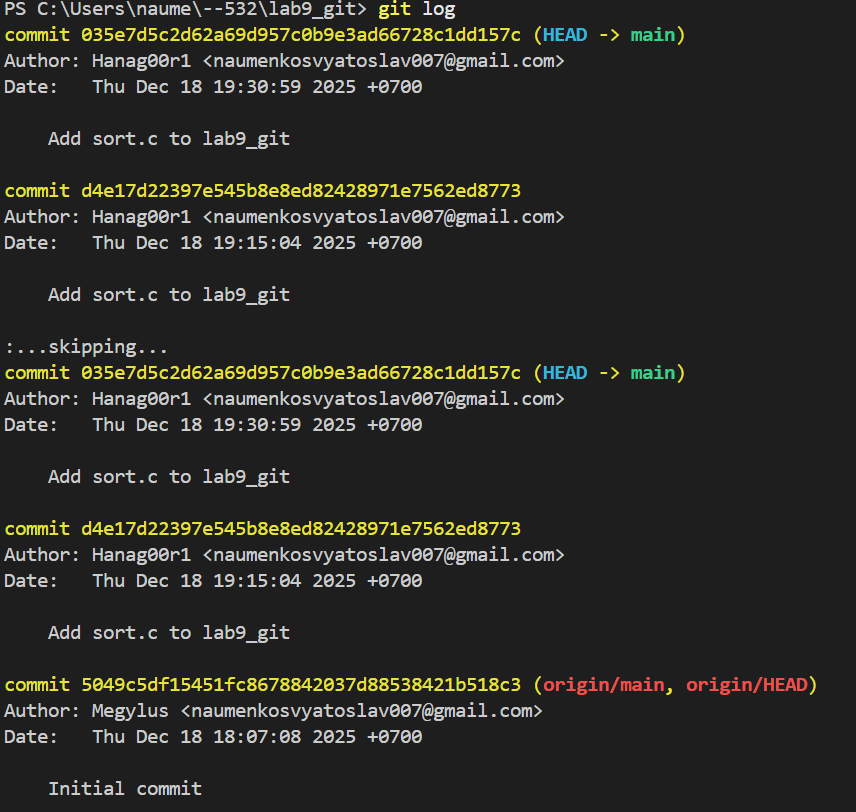
### последний коммит!!!
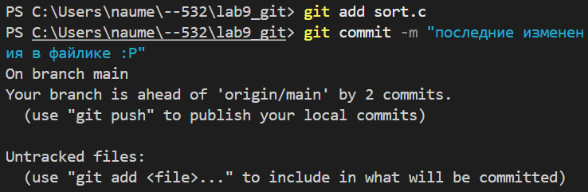
### улетел на гитхаб!!!
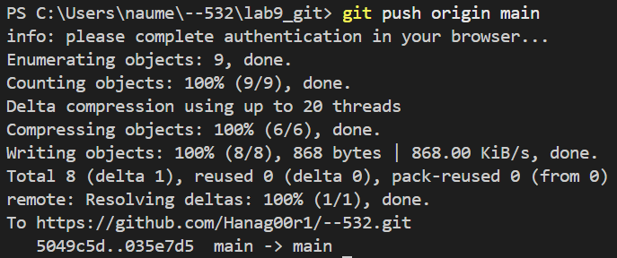

### ЧАААААСТЬ 2!!!!!

### создаем новую ветку!

### посмотрим какая у нас ветка

### что меняется?
доп ветка:

основная ветка:

### сделал файлик :D

### ADD XD

### коммит!!!

### еще один лог!!!

### вернулись в main

### тут нет файла!!!

### add и commit!

### вот новый лог!!!

### поменяли ветку-поменялся файл!!!

### различие веток!

